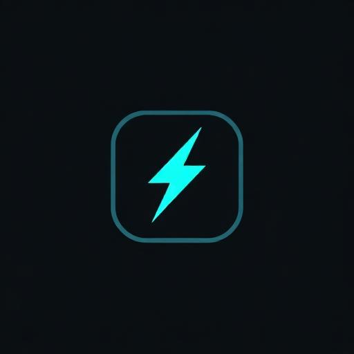

<div align="center">
  

  # SmartFill

  **Smart form autofill that learns.** <br>
  *A privacy-first Chrome extension that automatically learns and fills your forms locally.*

  <br />

  
  
  
  
  
</div>

<br />

## ✨ Features

- **🧠 Auto-Learning:** Fill a form once, and SmartFill remembers it.
- **⚡ Instant Autofill:** One-click to populate applications, signups, and profiles.
- **🔒 100% Local Privacy:** Zero cloud dependency. Your data never leaves your device and is stored securely in `chrome.storage.local`.
- **🎨 Premium UI:** Built with shadcn-ui, Tailwind CSS, and beautifully animated 3D backgrounds.

## 🚀 Getting Started

Follow these steps to set up the project locally for development.

### Prerequisites
- [Node.js](https://nodejs.org/) (v18 or higher)
- npm (comes with Node.js)

### Installation

1. **Clone the repository and install dependencies:**
   ```sh
   git clone https://github.com/yourusername/SmartFill.git
   cd SmartFill
   npm install
   ```

2. **Run the development UI server:**
   ```sh
   npm run dev
   ```
   This will start the Vite dev server to view the dashboard and settings interface locally at `http://localhost:8080`.

3. **Build the Chrome Extension:**
   ```sh
   npm run build
   ```
   The built extension assets will be available in the `dist` directory.

### Loading the Extension in Chrome

1. Open Chrome and navigate to `chrome://extensions/`
2. Enable **Developer mode** in the top right corner.
3. Click **Load unpacked** and select the `dist` folder generated by the build command.

## 📂 Project Structure

- `src/` - Contains the React source code.
  - `components/` - Reusable UI components (shadcn-ui).
  - `pages/` - React Router pages (Landing, Profile Viewer, Settings).
  - `services/storage/` - `chrome.storage.local` abstraction layer.
  - `contexts/` - React Context providers (e.g., AuthContext for profile data).
- `extension/` - Contains Chrome extension background scripts and content scripts.

## 🛡️ Privacy & Architecture

SmartFill was refactored to be a completely offline extension. There is no backend, no database, and no authentication provider. All user data and preferences are saved locally on the user's machine utilizing the `chrome.storage.local` API.

## 📄 License

This project is licensed under the MIT License.
